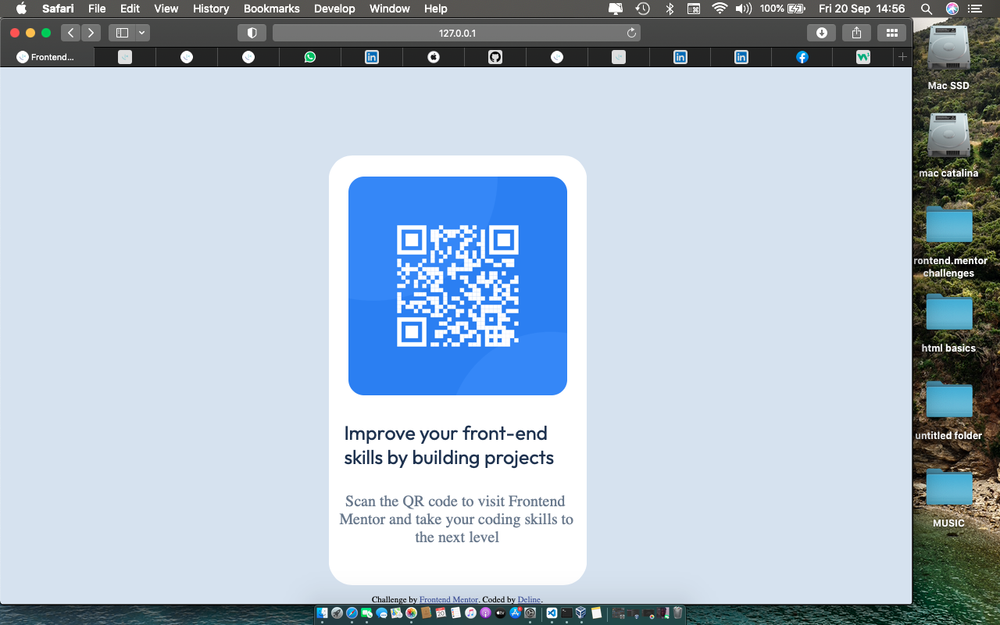

# Frontend Mentor - QR code component solution

This is a solution to the [QR code component challenge on Frontend Mentor](https://www.frontendmentor.io/challenges/qr-code-component-iux_sIO_H). Frontend Mentor challenges help you improve your coding skills by building realistic projects. 

## Table of contents

- [Overview](#overview)
  - [Screenshot](#screenshot)
  - [Links](#links)
- [My process](#my-process)
  - [Built with](#built-with)
  - [What I learned](#what-i-learned)
  - [Continued development](#continued-development)
  - [Useful resources](#useful-resources)
- [Author](#author)
- [Acknowledgments](#acknowledgments)

**Note: Delete this note and update the table of contents based on what sections you keep.**

## Overview

### Screenshot



### Links

- Solution URL: [QRCODE SOLUTION URL](https://github.com/Deline-swift/fem-qrcode)
- Live Site URL: [QRCODE LIVE SOLUTION](https://deline-swift.github.io/fem-qrcode/)

## My process

### Built with

- Semantic HTML5 markup
- CSS for styling
- CSS custom properties
- Mobile-first workflow


### What I learned

I learnt how to use CSS custom properties which helped me to easily reuse styles in my design. In the snippet below i defined colors,font-weight and font-sizes i used in my design


```css
:root{
    --fs-p:50px;
    --fw-1:700px;
    --fw-2:400px;
    --White: hsl(0, 0%, 100%);
   --Slate300: hsl(212, 45%, 89%);
    --Slate500: hsl(216, 15%, 48%);
    --Slate900: hsl(218, 44%, 22%);

    --sm:375px;
    --lg:1440px;
    
}
```


### Continued development
Am still not very comfortable with position in css so thats one thing i look forward to working on.


### Useful resources

- [w3schools](https://www.w3schools.com) - This help me to understand what css custom properties was all about which i implented in my design


## Author


- Frontend Mentor - [@Deline-Swift](https://www.frontendmentor.io/profile/Deline-swift)


## Acknowledgments

Am grateful to the Eschosys team who help me understand how css selectors work.


